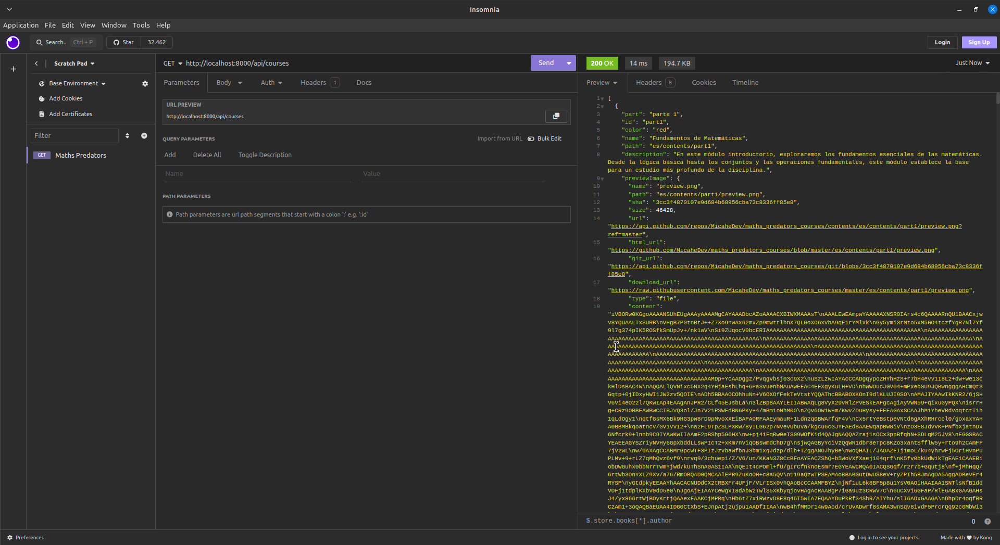

# MathsPredators API

Esta API está desarrollada en TypeScript y Express.js, utilizando Axios para obtener recursos como imágenes y contenido de los cursos desde un repositorio en GitHub.

## Configuración

La configuración de la API se realiza manualmente y de manera estática por el momento. Pronto se implementará una interfaz CMS para automatizar este proceso.

## Tecnologías Utilizadas

- TypeScript
- Express.js
- Axios

## Rutas

 - /api/courses
 - /api/courses/:part
 - /api/courses/:part/:subPart
 - /api/courses/:part/:subPart/:contentPart

## Uso

Para utilizar la API, clona el repositorio y sigue los pasos de configuración adecuados.

## Contribución

¡Las contribuciones son bienvenidas! Si deseas colaborar con este proyecto, asegúrate de seguir las pautas de contribución.

## Contacto

Para cualquier pregunta o sugerencia, no dudes en ponerte en contacto con el equipo de desarrollo.

